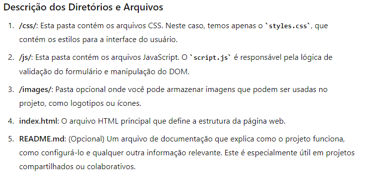

# Validação de Dados de Usuário
## Recursos utilizados
- Cursor IDE
- Materiais do Youtube 
- PDFs
- Outras experiências anteriores
- ChatGPT (Para direcionamento global)
- Blackbox AI (Para auxílio e revisão de códigos)
## Tecnologias Utilzadas
### Frontend
- HTML5 e CSS3
- Java Script (Comunicação com o Banco de Dados)
- MySQL (Banco de Dados)
## Servidor
Construí um Servidor bem simples com o Java Script que é a linguagem muito versátil para comunicação no Backend. 
## Banco de Dados
Utilizei o Mongo para construir uma estrutura de Dados onde serão arquivados os dados de inputs dos usuário que se cadastram no formulário. 
## Estrutura dos Diretórios
 A estrutura do diretório é simples e fácil de ser manutenida. Eis abaixo o aspecto de organização das pastas:
 

 

 ## Como Usar Esta Estrutura
 - index.html: Acesse diretamente este arquivo no navegador para visualizar a interface
 - styles.css: Contém todos os estilos usados no projeto. Você pode adicionar ou modificar estilos aqui.
 - script.js: Aqui está a lógica de validação e manipulação de eventos no formulário.

 # Resumo Geral
 Essa estrutura simples é um bom ponto de partida para pequenos projetos e pode ser facilmente expandida conforme o projeto cresce.

 